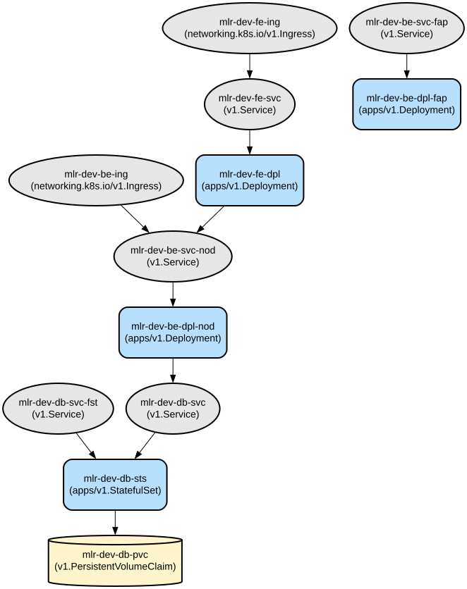

# Kubernetes 기반 다중 계층 애플리케이션 배포 프레임워크

이 저장소는 프론트엔드, 백엔드, 데이터베이스 컴포넌트로 구성된 확장 가능한 다중 계층 애플리케이션 아키텍처를 위한 종합적인 Kubernetes 배포 구성을 제공합니다. Kubernetes 네이티브 리소스를 통해 보안 통신, 리소스 관리 및 고가용성을 구현합니다.

이 프레임워크는 React 프론트엔드, 이중 백엔드 서비스(Node.js 및 FastAPI), MySQL 데이터베이스로 구성된 현대적인 웹 애플리케이션 스택을 지원하며, 인증 통합(Kakao, Naver, Google), TLS 암호화, 자동 스케일링 기능을 포함합니다. 네임스페이스, 네트워크 정책 및 리소스 할당량을 통해 컴포넌트 간 적절한 격리를 제공하는 프로덕션 준비 인프라를 제공합니다.

## 저장소 구조
```
.
├── 01-Namespace.yaml          # 프론트엔드, 백엔드, 데이터베이스를 위한 격리된 네임스페이스 정의
├── 02-Configmap.yaml         # 프론트엔드 및 백엔드 서비스를 위한 애플리케이션 구성
├── 03-Secret.yaml           # 민감한 데이터 저장(API 키, 자격 증명, TLS 인증서)
├── 04-PV-PVC.yaml          # 데이터베이스를 위한 영구 저장소 구성
├── 05-SA.yaml              # 서비스 계정 정의
├── 06-Role.yaml            # RBAC 역할 정의
├── 07-RoleBinding.yaml     # RBAC 역할 할당
├── 08-Ingress.yaml         # TLS 종료를 포함한 외부 접근 구성
├── 09-Service.yaml         # 내부 서비스 네트워킹 구성
├── 10-StatefulSet.yaml     # 데이터베이스 배포 구성
├── 11-Deployment.yaml      # 애플리케이션 배포 구성
├── 12-HPA.yaml            # 수평적 Pod 자동 스케일링 구성
├── 13-LimitRage.yaml      # 네임스페이스별 리소스 제약 조건
├── 14-Netpol.yaml         # 네트워크 보안 정책
└── 15-ResourceQuota.yaml   # 네임스페이스 리소스 제한
```

## 사용 지침
### 전제 조건
- Kubernetes 클러스터 (v1.20+)
- kubectl CLI 도구
- Nginx Ingress Controller
- OpenEBS 스토리지 프로바이더
- Helm (v3+)
- HTTPS를 위한 TLS 인증서

### 설치

1. 네임스페이스 생성:
```bash
kubectl apply -f 01-Namespace.yaml
```

2. ConfigMap과 Secret 생성:
```bash
kubectl apply -f 02-Configmap.yaml
kubectl apply -f 03-Secret.yaml
```

3. 스토리지 설정:
```bash
kubectl apply -f 04-PV-PVC.yaml
```

4. RBAC 구성:
```bash
kubectl apply -f 05-SA.yaml
kubectl apply -f 06-Role.yaml
kubectl apply -f 07-RoleBinding.yaml
```

5. 핵심 컴포넌트 배포:
```bash
kubectl apply -f 10-StatefulSet.yaml
kubectl apply -f 11-Deployment.yaml
```

6. 네트워킹 구성:
```bash
kubectl apply -f 08-Ingress.yaml
kubectl apply -f 09-Service.yaml
kubectl apply -f 14-Netpol.yaml
```

7. 리소스 관리 적용:
```bash
kubectl apply -f 12-HPA.yaml
kubectl apply -f 13-LimitRage.yaml
kubectl apply -f 15-ResourceQuota.yaml
```

### 문제 해결

일반적인 문제와 해결 방법:

1. Pod 시작 문제
```bash
kubectl get pods -n mlr-dev-fe-ns
kubectl get pods -n mlr-dev-be-ns
kubectl get pods -n mlr-dev-db-ns
kubectl describe pod <pod-name> -n <namespace>
```

2. 서비스 연결 문제
```bash
kubectl get svc -A
kubectl describe svc mlr-dev-fe-svc -n mlr-dev-fe-ns
kubectl describe svc mlr-dev-be-svc-nod -n mlr-dev-be-ns
```

3. Ingress 문제
```bash
kubectl get ing -A
kubectl describe ing mlr-dev-fe-ing -n mlr-dev-fe-ns
```

## 데이터 흐름
이 애플리케이션은 컴포넌트 간 보안 통신이 구현된 3계층 아키텍처를 구현합니다. 프론트엔드 요청은 Ingress 컨트롤러를 통해 적절한 백엔드 서비스로 라우팅되며, 이는 내부 서비스 디스커버리를 통해 데이터베이스와 상호 작용합니다.

```ascii
External Users
     ↓
[Ingress Controller (TLS)]
     ↓
[Frontend Service]
     ↓
[Backend Services] → [Redis Cache]
     ↓
[MySQL Database]
```

컴포넌트 상호작용:
1. 모든 외부 트래픽은 Ingress에서 TLS 종료됨
2. 프론트엔드는 포트 3000에서 Node.js 백엔드와 통신
3. 프론트엔드는 포트 5000에서 FastAPI 백엔드와 통신
4. 백엔드 서비스는 OAuth 제공자와 인증
5. Node.js 백엔드는 포트 3306에서 MySQL 데이터베이스에 연결
6. FastAPI 백엔드는 캐싱을 위해 Redis에 연결
7. 네트워크 정책은 보안 통신 경로를 강제
8. HPA는 CPU 사용률에 기반하여 컴포넌트를 자동으로 스케일링

## 인프라



### 컴퓨팅 리소스
- 프론트엔드 배포: 리소스 제한이 있는 3개의 복제본
- 백엔드 배포: 각각 3개의 복제본 (Node.js 및 FastAPI)
- 데이터베이스 StatefulSet: 단일 MySQL 인스턴스

### 네트워킹
- Ingress: TLS 종료가 있는 Nginx 컨트롤러
- 서비스: 내부 통신을 위한 ClusterIP
- 네트워크 정책: 네임스페이스 간 엄격한 통신 규칙

### 스토리지
- MySQL: OpenEBS 스토리지 클래스가 있는 영구 볼륨
- 리소스 할당량: 네임스페이스당 5Gi 스토리지 제한

### 보안
- 외부 접근을 위한 TLS 암호화
- 네임스페이스 격리
- 최소 권한의 RBAC
- 민감한 데이터를 위한 시크릿 관리